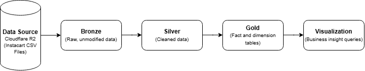

# 🛒 Instacart Data Pipeline Architecture

## Overview

This document describes the **layered architecture** of the Instacart pipeline, following the **Bronze → Silver → Gold** (Medallion) design pattern. Each layer represents a stage of data refinement, moving from raw ingested data to clean, structured data, and finally to business-ready analytical models.



---

## Data Source

The pipeline is built on the **Instacart dataset**, sourced from a **Cloudflare R2 bucket** and accessed in Databricks via a configured **Unity Catalog External Location**.

- **External Location:** `FTW-B12-DE-R2`
- **Storage provider:** Cloudflare R2 (S3-compatible object storage)
- **Access path in Databricks:** `/Volumes/ftw/instacart/ftw-b12-de/shared/week06/instacart_csv/`
- **Format:** CSV files (one file per entity, e.g., `aisles.csv`, `departments.csv`, `orders.csv`, `products.csv`, `order_products__prior.csv`, `order_products__train.csv`)
- **Ingestion method:** `read_files()` — Databricks SQL function used to read CSV files directly from the mounted Volume path into raw tables
- **Authentication:** Managed via a Unity Catalog storage credential linked to the `FTW-B12-DE-R2` external location (credentials stored securely, not included in this document)

**Example ingestion pattern:**
```sql
SELECT * FROM read_files(
  '/Volumes/ftw/instacart/ftw-b12-de/shared/week06/instacart_csv/aisles.csv'
)
```

---

## 🥉 Bronze Layer — `01_raw/`

**Purpose:** Ingests raw data directly from the source system with **no transformation applied**. This layer is an exact, untouched copy of the source data — no cleaning, renaming, filtering, or restructuring — and acts as the single source of truth for raw records.

**Characteristics:**
- **No changes made to the data** — values, formats, and structure are identical to the source
- Schema mirrors the source system exactly
- Used for traceability and reprocessing if downstream layers need to be rebuilt

**Files:**
| File | Description |
|------|-------------|
| `01_raw_aisles.sql` | Raw ingestion of aisle data |
| `02_raw_departments.sql` | Raw ingestion of department data |
| `03_raw_order_products_prior.sql` | Raw ingestion of prior order-product data |
| `04_raw_order_products_train.sql` | Raw ingestion of training order-product data |
| `05_raw_orders.sql` | Raw ingestion of order data |
| `06_raw_products.sql` | Raw ingestion of product data |

---

## 🥈 Silver Layer — `02_clean/`

**Purpose:** Cleans, standardizes, and validates the raw data from the Bronze layer. This includes handling nulls, correcting data types, removing duplicates, and applying consistent naming conventions.

**Characteristics:**
- Data quality rules applied
- Standardized column names and formats
- Deduplicated and validated records
- Serves as the trusted, analysis-ready foundation for the Gold layer

**Files:**
| File | Description |
|------|-------------|
| `01_clean_aisles.sql` | Cleaned and standardized aisle data |
| `02_clean_departments.sql` | Cleaned and standardized department data |
| `03_clean_order_products_prior.sql` | Cleaned and standardized prior order-product data |
| `04_clean_order_products_train.sql` | Cleaned and standardized training order-product data |
| `05_clean_orders.sql` | Cleaned and standardized order data |
| `06_clean_products.sql` | Cleaned and standardized product data |

---

## 🥇 Gold Layer — `03_mart/`

**Purpose:** Transforms cleaned data into a **dimensional model** (star schema) optimized for analytics and reporting. This layer contains dimension and fact tables built to support business intelligence use cases.

**Characteristics:**
- Star schema design (dimensions + facts)
- Business logic and aggregations applied
- Optimized for query performance and reporting tools

**Files:**
| File | Description |
|------|-------------|
| `01_dim_product.sql` | Product dimension table |
| `02_dim_order.sql` | Order dimension table |
| `03_dim_aisle.sql` | Aisle dimension table |
| `04_fact_order_products.sql` | Fact table capturing order-product level transactions |

---

## 📊 Visualization Layer — `04_visualization/`

**Purpose:** Contains query logic that powers dashboards and reports, built on top of the Gold layer's dimensional model. These queries answer specific business questions.

**Files:**
| File | Description |
|------|-------------|
| `01_top_ordered_products.sql` | Most frequently ordered products |
| `02_purchasing_behavior.sql` | Customer purchasing behavior analysis |
| `03_product_reorder_behavior.sql` | Product-level reorder behavior analysis |
| `04_aisle_reorder_rate.sql` | Reorder rate breakdown by aisle |
| `05_kpi.sql` | Key performance indicator summary metrics |

---

## Data Flow Summary

1. **Bronze (`01_raw`)** — Raw data lands as-is from the Instacart dataset (via Cloudflare R2), with no modifications.
2. **Silver (`02_clean`)** — Raw data is cleaned, validated, and standardized.
3. **Gold (`03_mart`)** — Clean data is modeled into dimension and fact tables for analytics.
4. **Visualization (`04_visualization`)** — Gold layer tables are queried to generate business insights and reports.
