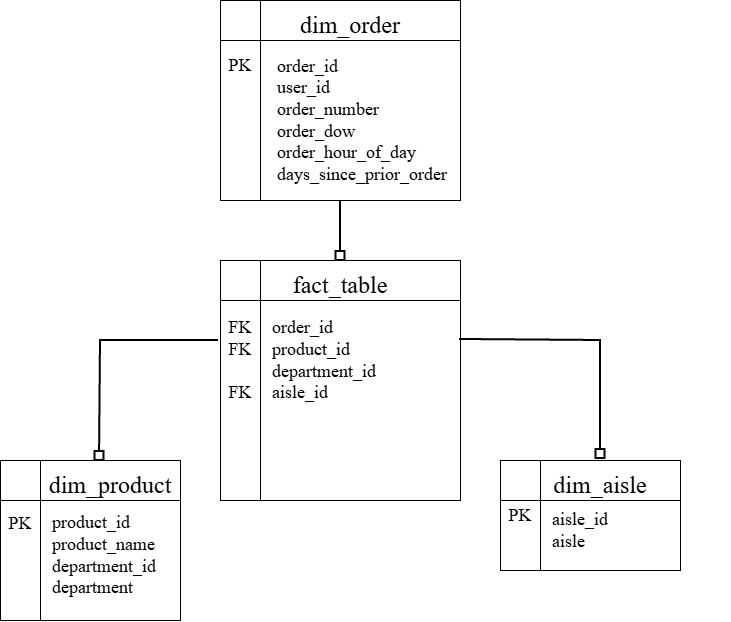

# Data Model Documentation: Instacart

---

## Star Schema Design

---

### Fact Table

**fact_order_products**
* **Grain:** One row per product order.
* **Primary Key:** `order_id`
* **Foreign Keys/Attributes:** `product_id`, `department_id`, `aisle_id`, `reordered`

---

### Dimension Tables

**dim_product**
* **Grain:** One row represents one distinct product, merged with department information.
* **Primary Key:** `product_id`
* **Other Fields:** `product_name`, `department_id`, `department`

**dim_order**
* **Primary Key:** `order_id`
* **Other Fields:** `user_id`, `order_number`, `order_dow`, `order_hour_of_day`, `days_since_prior_order`

**dim_aisle**
* **Primary Key:** `aisle_id`
* **Other Fields:** `aisle`
